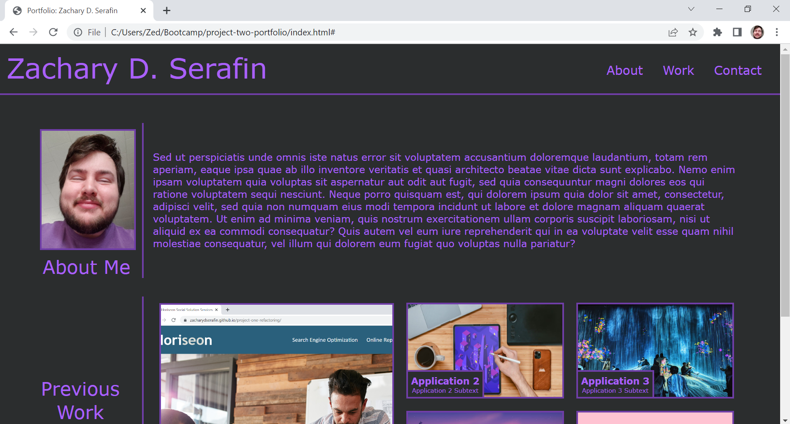

# University of Arizona Coding Boot Camp: Project Two - Portfolio

*Challenge 02 - Utilizing skills we learned in "Module 2: Advanced CSS"*

## Description

The goal of Project (or Challenge) Two was to create our own portfolio webpage from scratch, using only HTML and CSS. We were given the acceptance criteria for the challenge and a gif demonstrating an example portfolio to use as our guide. The acceptance criteria included having a navbar that linked to sections of the site, an "About Me" section with a profile image or avatar, a section for deployed applications that include links in the images, and a "Contact Me" section with links to various platforms.

*Note: for the time being, the "About Me" section is comprised of filler text, and most of the images in the "Previous Work" section are placeholders. These will be replaced as I develop as a coder and amass more projects to showcase.*

## Screenshot

## Links

*Link to deployed webpage:* https://zacharydserafin.github.io/project-two-portfolio/

*Link to GitHub repository:* https://github.com/zacharydserafin/project-two-portfolio

## Credits

*Eric Meyer*: Provided the reset.css template used for the project. Source is linked here and in the reset.css file itself.

http://meyerweb.com/eric/tools/css/reset/ 
   v2.0 | 20110126
   License: none (public domain)

